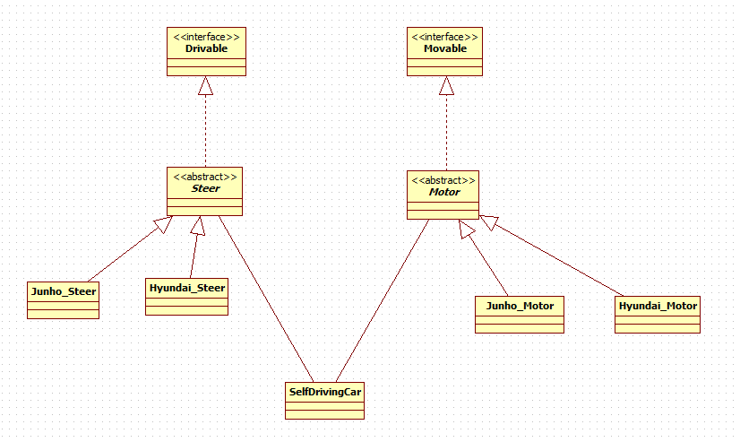

### 주어진 코드를 DIP(Dependency Inversion Principle)를 따르도록 수정하시오

``` java
interface Driveable {
    void accelerate();
    void steerRight();
    void steerLeft();
    void steerStraight();
    void brake();
};

class SelfDrivingCar {
    void accelerate() {
        // implementation here
    }
    void steerRight() {
        // implementation here
    }
    void steerLeft() {
        // implementation here
    }
    void steerStraight() {
        // implementation here
    }
    void brake() {
        // implementation here
    }
};
```
### 문제상황
- 클래스 SelfDrivingCar에서 Drivable 인터페이스를 concrete 하게 구현함.
- Drivable 인터페이스에 기능이 새로 추가된다면, SelfDrivingCar 클래스에서 영향을 줄 수 있음.
- 따라서 Abstract Should not depend upon details, Details should depend upon abstractions. 를 위반 


  

### 나의 솔루션
- Drivable 인터페이스를 모터를 가속, 브레이크 하는 기능에 관한 Movable 인터페이스로,
- 운전대를 회전하는 기능에 관한 Drivable 인터페이스로 분리함
- 그리고 SelfDrivingCar 클래스의 부품인 모터 Motor, 운전대 Steer은 다양한 회사의 부품으로서 존재할 수 있기 때문에
  여러 회사들의 Motor간 공통되는 추상 클래스 Motor, Steer를 선언함.
- 이를 통해 SelfDrivingCar 클래스에서는 다형성을 활용해 여러 기업에서 구체화한 부품 정보를 활용할 수 있음.

``` java
public interface Driveable {
    void steerRight();
    void steerLeft();
    void steerStraight();
}
public interface Movable {
    void accelerate();
    void brake();
}
public abstract class Motor implements Movable{
    int speed;
    public void setSpeed(int speed) { this.speed = speed; }
    public abstract int getSpeed();
}
public abstract class Steer implements Driveable{
    double steerAngle;
    public void setWheelAngle(double wheelAngle) { this.steerAngle = wheelAngle; }
    public abstract double getSteerAngle();
}
public class JunhoMotor extends Motor{
    @Override
    public int getSpeed() {
        System.out.println("Junho Motor's current speed is " + this.speed);
        return this.speed;
    }
    @Override
    public void accelerate() {
        System.out.println("Accelerating...");
        this.setSpeed(this.getSpeed() * 2);
    }
    @Override
    public void brake() {
        System.out.println("Brake..!");
        this.setSpeed(this.getSpeed() - 10);
    }
}
public class JunhoSteer extends Steer {
    @Override
    public void steerRight() {
        System.out.println("steering right...");
        this.setWheelAngle(this.steerAngle + 0.1);
    }
    @Override
    public void steerLeft() {
        System.out.println("steering right...");
        this.setWheelAngle(this.steerAngle - 0.1);
    }
    @Override
    public void steerStraight() {
        System.out.println("steering straight...");
        this.setWheelAngle(this.steerAngle * 1);
    }
    @Override
    public double getSteerAngle() {
        System.out.println("Junho Steer's current angle is " + this.steerAngle);
        return this.steerAngle;
    }
}
public class SelfDrivingCar {
    Motor motor;
    Steer steer;

    SelfDrivingCar(Motor motor, Steer steer){
        this.motor = motor;
        this.steer = steer;
    }
    SelfDrivingCar(){
        this(new JunhoMotor(), new JunhoSteer());
    }
}
public class Test {
    public static void main(String[] args){
        SelfDrivingCar junho = new SelfDrivingCar();
        junho.motor.setSpeed(1);
        junho.steer.setWheelAngle(1.0);
        junho.motor.accelerate();
        junho.motor.accelerate();
        junho.motor.accelerate();
        junho.steer.steerLeft();
        junho.steer.getSteerAngle();
        junho.steer.steerLeft();
        junho.steer.getSteerAngle();
    }
}

```

