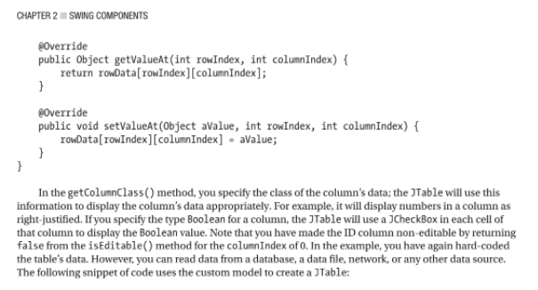

### 문제 정의

자바 스윙 패키지의 추상 클래스인 AbstractTableModel를
재정의하여, 
Rocket 객체 배열을 2차원 테이블의 원소로 하는 RocketTable를 
작성하라.

### 해결 방안
- 어댑터 패턴을 이용.  
- 추상화된 타겟 `AbstractTableModel`에 adaptee인 엔티티 클래스 `Rocket` 를 적용 시키는 `RocketTable` 클래스 작성.
  

주요 포인트
- getColumnCount() 재정의
- getRowCount() 재정의
- getValueAt() 재정의
    - 이 때, 일단 나는 해당 문제 해결을 위해 간단하게 switch 구문으로 반환하였음.
    - 구글링 결과 해당 부분을 2차원 배열에서 table[row_idx][col_idx] 형태로 바로 반환하는 경우가 있었다.
    
      > Java APIs, Extensions and Libraries: With JavaFX, JDBC, jmod, jlink, Networking, and the Process API - Kishori Sharan
      > 
      
https://books.google.co.kr/books?id=P6VUDwAAQBAJ&pg=PA162&lpg=PA162&dq=java+jtable+getvalueat+override+example&source=bl&ots=Iz5crmrUZ7&sig=ACfU3U367y2VGdOcrWFbTmLeWjynJfntCw&hl=en&sa=X&ved=2ahUKEwjc89TPvv_2AhXZZ94KHTHzBvwQ6AF6BAgpEAM#v=onepage&q=java%20jtable%20getvalueat%20override%20example&f=false
       